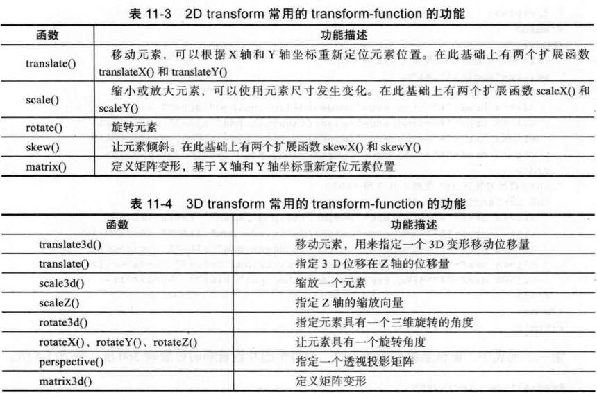

#图解CSS3核心技术与实战

## Selector

* 基本选择器
* 层次选择器
* 伪类选择器
* 伪元素选择器
* 属性选择器

```
	-基本选择器    ==> ["ID","通配","元素","类"].map((str)=>str+"选择器");

	-层次选择器    ==> {
						  "E   F" : "匹配位于E中的F",
						  "E > F" : "匹配是父元素是E的F",
						  "E + F" : "匹配在E后的第一个同胞F",
						  "E ~ F" : "匹配位于E后的所有F"
    }

	-伪类选择器    ==>  {
						  "动态伪类" : [":link",":visited",":active",":hover",":focus"]
						  "目标伪类" : [":target"]
						  "语言伪类" : [":lang"]
						  "UI  伪类" : [":checked",":checked",":disabled"]
						  "结构伪类" : [":nth-child(n)",":nth-of-type(n)",":root",":empty"]
						  "否定伪类" : [":not([type=submit])"]
	}

	-伪元素选择器  ==> ["::first-letter","::before","::selection"]

	-属性选择器    ==> {
						  "E[attr]"     : "匹配具有attr属性的E"，
						  "E[attr=val]" : "匹配attr属性值为val的E",
						  "E[attr|^~*&=val]" : "正则表达式"
	}
```

## Border

	-border-color
	-border-image
	-border-radius
	-box-shadow

```
	-border-image  ==>
		border-image  : none | <image> [<number>|<percentage>]{1,4} [/<border-width>{1,4}] ?[stretch|repeat |round]{0,2} 
	-border-radius ==>			
		border-radius : none | 	<length> {1,4} [/<length> {1,4}]
	-box-shadow    ==> 
		box-shadow : none | [<length><length><length>?<length>? ||<color>] [,<length><length><length>?<length>? ||<color>]+

		box-shadow : none | [inset x-offset y-offset blur-radius spread-radius color],[inset x-offset y-offset blur-radius spread-radius color]+
```

##Background 

###CSS2.1
* background-color
* background-image 
* background-repeat 
* background-attachment   //背景是否随页面滚动
* background-position     //背景位置

###CSS3
* background-origin  //指定背景图片起点(-position起始参照点)
* background-clip    //从...裁剪背景图片
* background-size    //背景图片尺寸大小
* background-break   //内联元素背景图平铺的循环方式(不常有)

```
	-color : ["#fff","red","rgba()","hls()"]
	-image : ["ulr()"]
	-repeat : ["repeat","x/y-repeat","no-repeat"]
	-attachment : ["scroll","fixed"]
	-position : ["(50% 50%)","(center center)"]

	-origin : ["padding-box","border-box","content-box"]
	-clip : ["padding-box","border-box","content-box","text"]
	-size : ["cover","contain","auto","100%","20px"]
	-break : ["bounding-box","each-box","continuous"]

```

```
 background : [<background-color>] [,<background-image>][,<background-repeat>] [,background-attachment][,background-position]

 background-position : <percentage>||<length>||[left|center|right] [,top|center|bottom]

 background-size : auto || <length> || <percentage> ||cover ||contain
```

##Text
```
Text --> Color --> Box --> Flex --> Columns --> 
```

##Gradient

* linear-gradient
* radial-gradient
* repeating-linear-gradient
* repeating-radial-gradient

###Syntax
```
    : linear-gradient([[<angle>|to <side-or-corner>],]?<color-stop>[,<color-stop>]+)
	---------------------------------------------------------------------------

		- <angle> : 0deg(↑) || 90deg(→)...
		- to <side-or-corner> : to top(↑) || to top left(↖)
		- <color-stop> : #123 [d%]? || rgba() || hsla()
	---------------------------------------------------------------------------

    : radial-gradient([[<shape>||<size>] [at <position>]?, | at <position>,]?<color-stop>[,<color-stop>]+);
    ---------------------------------------------------------------------------

		- <shape> : circle || ellipse
		- <size>  : closest-side || closest-corner || 
							<length> || <percentage> || ...
		- <position> : <length> || <percentage> || left right || ... 
		- <color-stop> : #123 [d%]? || rgba() || hsla()
	 --------------------------------------------------------------------------
	
	: repeating-linear-gradient 参数与linear-gradient类型
	: repeating-radial-gradient 参数与linear-gradient类型
	--------------------------------------------------------------------------
```

###Examples
```
	background-image : linear-gradient(
			to left, /*270deg*/
			rgb(255,0,0) 33%,
			rgb(0,255,0) 66%,
			rgb(0,0,255) 100%
		); 

	background-image : radial-gradient(
			50px 100px at 200px 150px,/*x-r y-r at (x,y)*/
			hsla(120,70%,60%,.6),
			hsla(240,70%,60%,.9)
		);

	background-image : radial-gradient(
			40% 80% at 50% 50%,/*x-r y-r at (50%,50%)*/
			hsla(120,70%,60%,.6),
			hsla(240,70%,60%,.9)
		);
	
	background-image : repeating-linear-gradient(red,green 40px, orange 80px);

	background-image : repeating-radial-gradient(red,green 40px, orange 80px);
```

##Transform

* translate
* rotate
* scale
* skew

```
	-translate : translate(标准单位) translateX/Y/Z/3d()
	-scale : scale(0-1) scaleX/Y/Z/3d()
	-rotate : rotate(deg) rotateX/Y/3d()
	-skew : skew(deg) skewX/Y()
```

* transform

```
	transform : none | <transform-function> [<transform-function>]* 
	叠加效果一般都是用逗号隔开，而transform则用空格分隔开。
```


```
	-transform-origin   :  元素变换的参照位置  (类似 background-position)
	-transform-origin-z :  3d元素变换的参照位置
	-transform-style : preserve-3d || flat 建立3d渲染环境
	-perspective : none || <length> 视距 父元素上
	-perspective(<length>) : 激活3d舞台 当前元素上。
	-perspective-origin :  视距的参照位置 (类似 background-position)
	-backface-visibility : visible || hidden 背面是否可见 
```


[正则表达式](http://www.cnblogs.com/deerchao/archive/2006/08/24/zhengzhe30fengzhongjiaocheng.html)